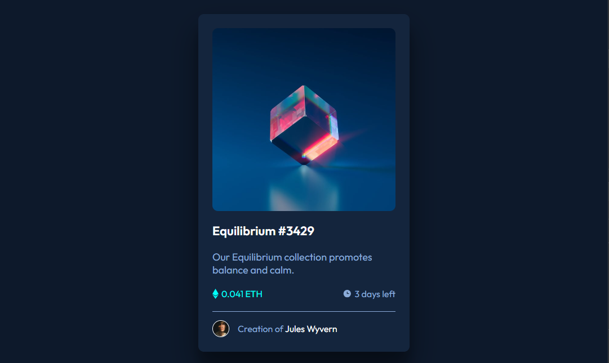
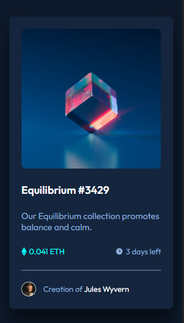

# Frontend Mentor - NFT preview card component solution

This is a solution to the [NFT preview card component challenge on Frontend Mentor](https://www.frontendmentor.io/challenges/nft-preview-card-component-SbdUL_w0U). Frontend Mentor challenges help you improve your coding skills by building realistic projects. 

## Table of contents

- [Overview](#overview)
  - [Screenshot](#screenshot)
- [My process](#my-process)
  - [Built with](#built-with)
  - [Continued development](#continued-development)
  - [Useful resources](#useful-resources)
- [Author](#author)

## Overview

### Screenshot

### Links

- Solution URL: [Frontend Mentor SOlution](https://github.com/beowulfcodes/nft-preview-card-component-challenge)
- Live Site URL: [Add live site URL here](https://your-live-site-url.com)

## My process

- First, lay down all the images and texts (paragraphs, h1s, etc...) sequentially.
- Next, group the images and texts accordingly into containers/cards.
- Then, arrange this containers/cards into flexbox structure (I am using flexbox, you can use grid if you want to)
- Now, create sections with headings. If your content has distinct categories or sections, you can separate them using headings (e.g., h1, h2, etc...) to provide a clear hierarchy.\
- And lastly, apply styling and formatting according to the style-guide.md.

### Built with

- Semantic HTML5 markup
- CSS custom properties
- Flexbox

### Continued development

I might research for the next couple of hours on how to properly utilize media queries. Also, is mobile-first design a good practice? I've been starting my design in desktop, though...

### Useful resources

- [Flexbox Tutorial](https://internetingishard.netlify.app/html-and-css/flexbox/index.html) - This helped me on how to use flexbox. 

## Author

- Website - [Aaron A. Santillan](**no site as of now)
- Frontend Mentor - [@beowulfcodes](https://www.frontendmentor.io/profile/beowulfcodes)

## Acknowledgments

I would like to mention Traversy Media on how I get on this website!

